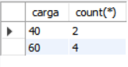
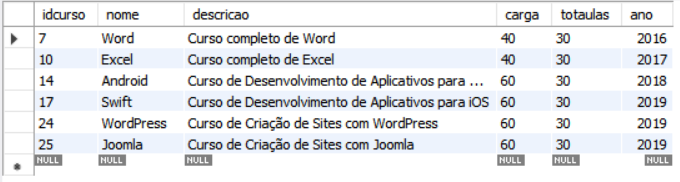
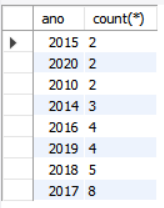
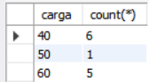

# Curso MySQL #03 - Criando o primeiro Banco de Dados

>Bancos de dados são conjuntos de tabelas, tabelas são conjuntos de registros e registros são conjuntos de campos.

## Criando banco de dados:
~~~~sql
create database cadastro;
~~~~

## Criando tabelas:
~~~~sql
create table pessoas(

);
~~~~

## Colocando os campos:
~~~~sql
create table pessoas(
nome,
idade,
sexo,
peso,
altura,
nacionalidade
);
~~~~

## Tipos primitivos

### 1. Numérico
#### Inteiro:
* TinyInt
* SmallInt
* Int
* MediumInt
* BigInt

> A diferença entre estes tipos numéricos é a quatidade de bytes que vai ser utilizado para armazenar os dados.

#### Real:
* Decimal
* Float
* Double
* Real

> A diferença entre estes tipos numéricos é a quatidade de bytes que vai ser utilizado para armazenar os dados.

#### Lógico
* Bit
* Boolean

> Guarda valores como true ou false.

### 2. Data/tempo
* Date
* DateTime
* TimeStamp
* Time
* Year

> Gurda valores de tempo como data, hora, ano etc.

### 3. Literal
#### Caractere:
* Char 
>Coloca espaços fixos. Ex: armazena o campo 'nome' com 30 espaços independente do números de letras.
* VarChar
>Armazena o campo 'nome' de acordo com o número de letras.

#### Texto:
* TinyText
* Text
* MediumText
* LongText

> O tipo primitivo 'Texto' é para textos longos.
> ''Caractere' são para conteúdos menores como nome, telefone e endereço.

####  Binário:
* TinyBlob
* Blob
* MediumBlob
* LongBlob

> O tipo Blob permite guardar qualquer coisa em binário como uma imagem apesar de nãos ser ecomendado guardar imagens dentro de um banco de dados.

#### Coleção:
* Enum
* Set
> Serve para configurar quais são os valores permitidos e na hora do cadastro ele só vai aceitar estes valores.

### 4. Espacial
* Geometry
* Point
* Polygon
* MultiPolygon

> O tipo espacial permite guardar informações sobre volumétricos.

## Colocando tipos para cada um dos campos:
~~~~sql
create table pessoas(
nome varchar(30),
idade tinyint,
sexo char(1),
peso float,
altura float,
nacionalidade varchar(20)
);

~~~~
> Em 'idade, tinyint(3)' não precisa colocar o 3 entre parênteses

> Em ' sexo, char(1)' irá ser guardar uma letra independente se estiver preenchido ou não.

> O símbolo de ponto e vírgula indica o fim do comando

## Selcionando banco de dados

~~~~sql
use pessoas;
~~~~

## Mostrando estrutura interna de uma tabela

~~~~sql
describe pessoas;
~~~~

ou

~~~~sql
desc pessoas;
~~~~

# Curso MySQL #04 - Melhorando a Estrutura do Banco de Dados

## Apagando banco de dados:

~~~~sql
drop database cadastro;
~~~~

## Adicionando constraints:

~~~~sql
create database cadastro
default character set utf8
~~~~

## Adicionando collation:

~~~~sql
create database cadastro
default character set utf8
default collate utf8_general_ci;
~~~~

> Dessa forma o banco consegue trabalhar com caracteres espceciais e acentuações.

## Aprimorando o banco de dados:
~~~~sql
create table pessoas(
nome varchar(30) not null,
nascimento date,
sexo enum('M', 'F'),
peso decimal(5,2),
altura decimal (3,2),
nacionalidade varchat(20) default 'Brasil'
)default charset utf8;
~~~~
> Trocado o campo 'idade' por nascimento assim o sistema pode sempre atualizar a idade do usuário de acordo com a data de nascimento. 

> Adicionado 'default charset utf8' para padrão de caracteres especias.

> Adicionado uma constraint em 'nome varchar(30) not null' o valor not null faz se tornar obrigatório o preenchimento daquele campo.

> Adicionado o tipo 'date' em 'nascimento' para colocar a data de nascimento.

> Adicionado 'sexo enum('m', 'f'),' para que apenas sejam aceitam os dois valores entre aspas (m ou f).

> Adicionado 'peso decimal(5,2),'. O 5 reperesenta o número de casas no total e o 2 o número de casas após a virgula.

> Adicionado 'nacionalidade varchat(20) default 'Brasil'' se não colocar nada neste campo o padrão irá ser brasil.

## Colocando os campos entre crases:

~~~~sql
create table `pessoas`(
`nome` varchar(30) not null,
`nascimento` date,
`sexo` enum('M', 'F'),
`peso` decimal(5, 2),
`altura` decimal(3, 2),
`nacionalidade` varchar(20) default 'Brasil',
) default charset = utf8;
~~~~
 
> Isso permite serem ultilizados campos com acentos e espaços apezar de não ser recomendável

## Adcionando campos de chave primária:

~~~~sql
create table pessoas(
id int not null auto_increment,
nome varchar(30) not null,
nascimento date,
sexo enum('M', 'F'),
peso decimal(5,2),
altura decimal (3,2),
nacionalidade varchat(20) default 'Brasil'
)default charset utf8;
~~~~

> 'id int not null auto_increment,' autoincrementa o campo 'id' de acordo com o número de cadastros. A primeira pessoa vai ser id1, a segunda id2 etc.

## Adicionando campos como chave primária

~~~~sql
create table pessoas(
id int not null auto_increment,
nome varchar(30) not null,
nascimento date,
sexo enum('M', 'F'),
peso decimal(5,2),
altura decimal (3,2),
nacionalidade varchat(20) default 'Brasil',
primary key (id)
)default charset utf8;
~~~~
> O campo 'id' foi adicionado como chave primária.

## Curso MySQL #05 - Inserindo Dados na Tabela (INSERT INTO)

> Todo comando SQL que faz parte para dar definição de estrutura de banco de dados são DDL (Data Definition Language). 
>Ex: create database e create table.

## Incluindo dados dentro da tabela

### Adcionando campos dentro de listas:

~~~~sql
create database cadastro
default character set utf8
default collate utf8_general_ci;

create table `pessoas`(
`id` int not null auto_increment,
`nome` varchar(30) not null,
`nascimento` date,
`sexo` enum('M', 'F'),
`peso` decimal(5, 2),
`altura` decimal(3, 2),
`nacionalidade` varchar(20) default 'Brasil',
primary key (id)
) default charset = utf8;

(id, nome, nascimento, sexo, peso, altura, nacionalidade)
~~~~
### Adcionando valores dentro de listas:

~~~~sql
('1', 'Godofredo', '1984-01-2', 'M', '7.85', '1.83', 'Brasil');
~~~~
### Ligando os campos com os dados:

~~~~sql
insert into pessoas
(nome, nascimento, sexo, peso, altura, nacionalidade)
values
('Godofredo', '1984-01-02', 'M', '78.5', '1.83', 'Brasil');
~~~~

> Não é necessário colocar o 'id' já que ele já se autoincrementa

### Mostrandos os dados:
~~~~sql
select * from pessoas;
~~~~

### Técnicas para inserir dados:
> Ao invés de ocutar o id ele pode ser substuido pela constrain 'default':
~~~~sql
insert into pessoas
(id, nome, nascimento, sexo, peso, altura, nacionalidade)
values
(default, 'Maria', '1989-12-30', 'F', '55.2', '1.65', 'Portugal');

select * from pessoas;
~~~~

> Também pode ser utilizado na nacionalidade:

~~~~sql
insert into pessoas
(id, nome, nascimento, sexo, peso, altura, nacionalidade)
values
(default, 'Creuza', '1920-12-30', 'F', '50.2', '1.65', default);

select * from pessoas;
~~~~

> Se a ordem dos valores for a mesma dos campos não é necessário especificar os campos no início:

~~~~sql
insert into pessoas values
(default, 'Adalgiza', '1930-11-2', 'F', '63.2', '1.75', 'Irlanda');

select * from pessoas;
~~~~

> É possível inserir vários dados de uma vez:

~~~~sql
insert into pessoas values
(default, 'Cláudio', '1975-4-22', 'M', '99.0', '2.15', 'Brasil'),
(default, 'Pedro', '1999-12-3', 'M', '87', '2', default),
(default, 'Janaina', '1987-11-12', 'F', '75.4', '1.66', 'EUA')

select * from pessoas;
~~~~

> Comando de manipulação de dados são considerados DML (Data Manipulation Language) 
> Ex: Insert Into

# Curso MySQL #06 - Alterando a Estrutura da Tabela (ALTER TABLE e DROP TABLE)

## Alterando estrutura da tabela:

~~~~sql
alter table pessoas;
~~~~

## Adicionando colunas: 

> Colunas equivalem aos campos da tabela.
~~~~sql
add column profissao varchar(10);
~~~~

# Removendo colunas:

~~~~sql
alter table pessoas
drop column profissao;
~~~~

## Escolhendo a posição da coluna

~~~~sql
alter table pessoas
add column profissao varchar(10) after nome;
~~~~

> Isso coloca a coluna 'profissao' depois da coluna 'nome'

## Adicionando a coluna na primeira posição:

~~~~sql
alter table pessoas
add column codigo int first;
~~~~

> a palavra 'column' é opcional e pode ser omitida.

## Modificando definições:

~~~~sql
alter table pessoas
modify column profissao varchar(20) not null;
~~~~

> Aqui foi adicionada uma constraint 'not null' porém como o default do mysql é 'null' para os valores assim que se cria uma coluna, pode ser adicionado o seguinte código:

~~~~sql
alter table pessoas
modify column profissao varchar(20) not null default '';
~~~~

> Assim o default é definido para vazio ao invés de 'null'.

## Renomeando coluna

~~~~sql
alter table pessoas
change column profissao prof varchar(20);
~~~~

## Renomenado tabela

~~~~sql
alter table pessoas
rename to gafanhotos;
~~~~

> Os comando anteriores com o nome antigo da tabela irão resultar em erro.

## Criando mais uma tabela 

> 'if not exists' (se não existir faz algo)

> 'unique' não deixa colocar dois valores do campo com o mesmo nome

> unsigned não deixa colocar sinal nos números assim evitando números negativos e economizando 1 byte

~~~~sql
create table if not exists cursos (
nome varchar(30) not null unique,
descricao text,
carga int unsigned,
totaulas int unsigned,
ano year default '2024'
) default charset=utf8;

describe cursos;
~~~~

## Adicionando chave primaária

~~~~sql
alter table cursos
add primary key (idcurso);
~~~~

## Apagando tabela

~~~~sql
drop table if exists teste;
~~~~

> O alter table  e o drop table são comandos DDL (comandos de definição) porque mexem na estrutura.

# Curso MySQL #07 - Manipulando Linhas (UPDATE, DELETE e TRUNCATE)

> Linhas, tuplas e registros são a mesma coisa em MySQL.

> Campos, atributos e colunas são a mesma coisa em MySQL.

## Adicionando registros:

~~~~sql
insert into cursos values
('1', 'HTML5', 'Curso de HTML5', '40', '37', '2014'),
('2', 'Algorítimos', 'Lógica de Programação','20','15','2014'),
('3', 'Photoshop', 'Dicas de Photoshop CC','10','8','2014'),
('4', 'PGP', 'Curso de PHP para iniciantes','40,','20','2010'),
('5', 'Jarva', 'Introdução a Linguagem Java','10','29','2000'),
('6', 'MySQL', 'Banco de Dados MySQL','30','15','2016'),
('7', 'Word', 'Curso Completo de Word','40','30','2016'),
('8', 'Sapateado', 'Danças Rítmicas','40','30','2018'),
('9', 'Cozinha Árabe', 'Aprenda a fazer Kibe','40','30','2018'),
('10', 'Youtuber', 'Gerar polêmica e ganhar inscritos','5','2','2018');
~~~~

## Modificando linhas Incorretas:

~~~~sql
update cursos // atualize
set nome = 'HTML5' // configure
Where idcurso = '1'; // onde
~~~~

> Usa a chave primária 'idcurso = '1' porque só tem uma linha com o idcurso = 1. A partir disto é possivel identificar a linha onde se quer fazer a alteração.

> Dessa forma 'HTML4'da tabela vai ser substituido por 'HTML5'.

## Modificando mais de um valor ao mesmo tempo

~~~~sql
update cursos 
set nome = 'PHP', ano = 2015  
where idcurso = '4';
~~~~

> Apenas adicionando a virgula e o valor que deseja alterar já se pode alterar mais DE um valor ao mesmo tempo

> Dessa forma o valor de nome e ano foram alterados.

## Modificando linhas de forma limitada 

~~~~sql
update cursos 
set nome = 'JAVA', ano = 2015 , carga = '40' 
where idcurso = '5'
limit 1;
~~~~

> dessa forma usando o limit apenas 1 linha será afetada

## Modificando linhas de forma ilimitada

> Habilitar a permissão para modificar mais de uma linha ao mesmo tempo no MySQL: 
> edit > preferences > SQL editor > safe updates > desabilitar > reconectar

~~~~sql
update cursos 
set ano = '2050', carga = '800' 
where ano = '2018';
~~~~

> dessa forma todas as linhas com o ano  = 2018 serão afetadas.

> Se usasse o 'limit 1' afetaria apenas a primeira linha.

## Removendo linhas

~~~~sql
delete from cursos
where idcurso = '8';
~~~~

> Apaga a linha pelo id

## Deletando mais de uma linha ao mesmo tempo

~~~~sql
delete from cursos
where ano = '2050'
limit 2;
~~~~

> Usando o limit para limitar o número de linhas que serão apagadas.

## Removendo todas as linhas de uma tabela

~~~~sql
truncate cursos;
~~~~

### Comandos DDL (Data Definition Language):

* create database
* create table
* alter table
* drop table

### Comando DML (Data Manipulation Language)

* Insert into
* update
* delete
* truncate

# Curso MySQL #08 - Gerenciando Cópias de Segurança MySQL

## Exportando:
> Server > Data Export > selecionar banco de dados > Export to Self-Contained File > Include Create Schema > Start Export.

## Abrindo arquivo:
> documentos > dumps > arquivo msql.

## Importando:
> Server > Data Import > Import to Self-Contained File > ... > seleciona o arquivo msql > Start Import > refresh.

> Dump é a mesma coisa que criar uma cópia de um banco de dados.

## Mostrando tabelas:

~~~~sql
show tables;
~~~~

# Curso MySQL #09 - PHPMyAdmin (Parte 1)

> Comando no shell para usar comandos sql: 
>mysql -h localhost -u root -p

## Comandos para usar no shhell 

### Mostrar bancos de dados:

> show databases;

### Ver qual banco está ativo no momento:

> status;

### Ativar banco de dados:

> use cadastro;

### Mostrar tabelas:
> show tables;

> Usar seta para cima e para baixa volta no histórico de comandos.

# Curso MySQL #10 - PHPMyAdmin (Parte 2)

## Comando para mostar como foi criada a tabela com os valores:

~~~~sql
show create table amigos;
~~~~

### Mostra:

~~~~sql
 CREATE TABLE `amigos` (
  `id` int(11) NOT NULL AUTO_INCREMENT,
  `nome` varchar(30) NOT NULL,
  `telefone` varchar(11) DEFAULT NULL,
  PRIMARY KEY (`id`),
  UNIQUE KEY `nome` (`nome`)
) ENGINE=InnoDB DEFAULT CHARSET=utf8 COLLATE=utf8_general_ci
~~~~

## Comando para mostrar como foi criado o banco de dados

~~~~sql
show create database exemplo;
~~~~

### Mostra:

~~~~sql
+----------+------------------------------------------------------------------------------------------+
| Database | Create Database                                                                          |
+----------+------------------------------------------------------------------------------------------+
| exemplo  | CREATE DATABASE `exemplo` /*!40100 DEFAULT CHARACTER SET utf8 COLLATE utf8_general_ci */ |
+----------+------------------------------------------------------------------------------------------+
~~~~

## Gerando/exportando DUMP no phpmyadmin

> casinha > Personalizada - exibir todas as opções possíveis > selecionar opção > Executar

## Apagando banco de dados

> casinha > base de dados > selecionar o banco de dados > elimina

# Curso MySQL #11 - SELECT (Parte 1)

## Ordenando colunas pelo nome (ordem alfabética):

~~~~sql
select * from cursos
order by nome;
~~~~

## Ordenando colunas pelo nome de forma inversa:

~~~~sql
select * from cursos
order by nome desc;
~~~~

> Se no lugar de 'desc' for colocado 'asc' a ordem alfabética voltará a ser normal.

## Selecionando colunas:

~~~~sql
select nome, carga, ano from cursos;
~~~~

> Isso mostra apenas as colunas informadas e seus valores.

### Invertendo a ordem das colunas selecionadas:

~~~~sql
  select ano, nome, carga from cursos;
~~~~

### Ordenando colunas selecionadas pelo ano:

~~~~sql
select ano, nome, carga from cursos
order by ano;
~~~~

### Ordenando colunas selecionadas pelo ano e pelo nome:

~~~~sql
select ano, nome, carga from cursos
order by ano, nome;
~~~~

## Selecionando linhas

~~~~sql
select * from cursos
where ano = '2016'
order by nome;
~~~~

> Isso mostra todas as linhas com ano igual '2016'.

## Selecionando intervalos de linhas

~~~~sql
select nome, carga from cursos
where ano = '2016'
order by nome;
~~~~

> A coluna do ano não irá ser processada a não ser que coloque no select.

## Selecionando intervalos de linhas com operadores relacionais:

~~~~sql
select nome, descricao from cursos
where ano <= 2015
order by nome;
~~~~

> Dessa forma apenas as linhas com ano menor ou igual a 2016 irão ser processadas.

> Observação: o número 2015 não precisa estar entre aspas.

> Aceita operadores: =, <, >, <=, =>, (!= ou <>)

## Selecionando itervalo de linhas com comandos:

### between / and:
~~~~sql
select nome, ano from cursos
where ano between 2014 and 2016
order by ano desc, nome asc;
~~~~

> Irá mostrar os registros onde o ano esteja entre 2014 e 2016, ordenados peo ano de form descrescente e depois pelo nome.

### in:

~~~~sql
select nome, descricao, ano from cursos
where ano in (2014, 2016)
order by ano;
~~~~

> Irá mostrar os registros com os anos de 2014 e 2016 e ordenará pelo ano.

## Selecionando itervalo de linhas com operadores lógicos:

### and:
~~~~sql
select * from cursos 
where carga > 35 and totaulas < 30;
~~~~

> Irá mostar os registros onde a carga seja maior que 35 e o total de aula menor que 30.

### or:

~~~~sql
select nome, carga, totaulas from cursos 
where carga > 35 or totaulas < 30;
~~~~

> Dessa forma se os registros tiverem carga acima de 35 ou total de aulaas abaixo de 30 eles irão ser processados.

### Comandos DDL (Data Definition Language):

* create database
* create table
* alter table
* drop table

### Comandos DML (Data Manipulation Language)

* Insert into
* update
* delete
* truncate

## Comandos DQL (Data Query Language)

* select

# Curso MySQL #12 - SELECT (Parte 2)

## Usando o operador like:

~~~~sql
select * from cursos
where nome like 'P%';
~~~~

> Irá mostrar todos os registros com a letra inical 'P' antes de qualquer caractere ou nada.

### Wildcards:

~~~~sql
select * from cursos
where nome like '%a';
~~~~

> Irá mostrar todos os registros com a letra final 'A' após qualquer caractere ou nada.

~~~~sql
select * from cursos
where nome like '%a%';
~~~~

> Irá mostrar todos os registros com a letra 'A' em qualquer posição, após ou antes de qualquer caractere ou nada.

~~~~sql
select * from cursos
where nome not like '%a%';
~~~~

> Irá mostrar todos os registros que NÃO tenham a letra 'A' em qualquer posição.

~~~~sql
select * from cursos
where nome like 'PH%P';
~~~~

> Irá mostrar todos os registros que comecem com 'PH' e terminem com 'P'.

~~~~sql
select * from cursos
where nome like 'PH%P%';
~~~~

> Irá mostrar todos os registros que comecem com 'PH' e terminem com 'P' seguido de qualquer letra, número ou nada.

~~~~sql
select * from cursos
where nome like 'PH%P_';
~~~~

> Irá mostrar todos os registros que comecem com 'PH' e terminem com 'P' seguido OBRIGATÓRIAMENTE de qualquer letra ou número.

~~~~sql
select * from cursos
where nome like 'p__t%';
~~~~

> Irá mostrar todos os registros que tenham OBRIGATÓRIAMENTE exatamente dois caracteres após o 'p', e que depois tenham a letra 't' e que depois tenha qualquer número de caracteres.

~~~~sql
select * from gafanhotos
where nome like '%_silva%';
~~~~

> Irá mostrar todos os registros que tenham 'silva' em qualquer lugar com um espaço antes (Isso evita que nomes como 'Silvana' sejam processados).

## Distinguido

~~~~sql
select distinct nacionalidade from gafanhotos
order by nacionalidade;
~~~~

> Irá mostrar todos os registros da coluna 'nacionalidade' sem repetir caso haja mais de um mesmo registro.

## Funções de Agregação

### count:

~~~~sql
select count(*) from cursos;
~~~~

> Conta quantos registros tem na tabela.

~~~~sql
select count(*) from cursos where carga > 40;
~~~~

> Conta quantos registros com a carga maior de 40 tem na tabela.

~~~~sql
select count(nome) from cursos;
~~~~

> Conta quantos registros 'nome' tem na tabela.

### max:

~~~~sql
select max(carga) from cursos;
~~~~

> Mostra o registro com a maior carga da tabela.

~~~~sql
select max(totaulas) from cursos where ano = 2016;
~~~~

> Mostra o registro com o maior número de total de aulas da tabela onde o ano é igual a 2016.

### min:

~~~~sql
select nome, min(totaulas) from cursos where ano = 2016;
~~~~

> Mostra o nome e o menor número de total de aulas da tabela onde o ano é igual a 2016.

> OBS: Mostra epnas a primeira linha mesmo que tenham outras com o mesmo valor do campo.

### sum:

~~~~sql
select sum(totaulas) from cursos;
~~~~

> Soma o total dos registros da coluna 'totaulas' da tabela 'cursos'

~~~~sql
select sum(totaulas) from cursos where ano = 2016;
~~~~

> Mostra a soma dos registros da coluna 'totaulas' onde o ano é igual a 2016.

### avg:

~~~~sql
select avg(totaulas) from cursos;
~~~~

> Faz a média dos registros da coluna 'totaulas' da tabela 'cursos'.

~~~~sql
select sum(totaulas) from cursos where ano = 2016;
~~~~

> Faz a média dos registros da coluna 'totaulas' da tabela 'cursos' onde o ano é igual a 2016.
## Modificando linhas diretamente da estrutura da tabela:

> Clicar duas vezes no registro que quer editar > Editar o registro > Enter > Apply > Apply > Finish
> Também é possivel adicionar um novo registro clicando duas vezes nos campos ao final da tabela.

# Curso MySQL #13 - SELECT (Parte 3)

## Distinguindo:
~~~~sql
select distinct carga from cursos
order by carga;
~~~~

> Irá mostrar todas as cargas dos cursos sem repetição caso haja cargas com numeros iguais e ordena-las em ordem crescente

## Agrupando:

~~~~sql
select carga from cursos
group by carga;
~~~~

> Irá agrupar os registros que tem o mesmo valor

## Agrupando e Agregando:

~~~~sql
select carga, count(*)  from cursos
group by carga;
~~~~
> Irá agrupar os registros que tem o mesmo valor e mostrar o numero de total de registros em cada grupo.

## Agrupando com where
~~~~sql
select carga, count(*) from cursos where totaulas = 30
group by carga;
~~~~

> Irá mostrar as cargas dos registros que tenham o total de aulas iguais a 30.

> Os registros com o mesmo numero de carga que aparecerem serão agrupados.

> Aparecerá o número total de registros com mesmo número de carga  em cada grupo.

> É possível ver que o total de registros em cada grupo está de acordo com a tabela.

## Agrupando por coluna:

~~~~sql
select ano, count(*) from cursos
group by ano
order by count(*);
~~~~

> Mostra os registros do menor grupo para o maior

## Selecionando agrupamentos:

~~~~sql
select ano, count(*) from cursos
group by ano
having count(ano) >= 5
order by count(*) desc;
~~~~

> Mostra apenas os grupos com o número total de registros maior ou igual a 5.

> No having só pode usar o campo que foi agrupado no 'group by' no caso 'ano'

### Outro exemplo:
~~~~sql
select ano, count(*) from cursos
where totaulas = 30
group by ano
having ano > 2013
order by count(*) desc;
~~~~

> Mostra apenas os registros com total de aulas iguais a 30 

> Agrupa a seleção por ano

> E dentro desse agrupamento só vai mostrar quem tem o ano maior que 2013

> Vai aparecer assim

### Outro exemplo:

~~~~sql
select carga, count(*) from cursos 
where ano > 2015
group by carga
having carga > (select avg(carga) from cursos);
~~~~

> Seleciona as cargas dos cursos onde o ano é maior que 2015.

> Agrupa a seleção por carga.

> E dentro desse agrupamento mostra as cargas que são maiores que a média de cargas no (no caso 36).

> O count serve para mostrar o total de registros dentro de cada grupo.

> Vai mostrar assim

# Curso MySQL #14 - Modelo Relacional

## Entidades e atributos:

* Entidade é onde se armazenam os dados.

* Dados são atibutos ou seja uma entidade é um conjunto de atributos.

> Aqui temos duas entidades com seus respectivos atributos.

## Relacionamentos

* Faz a relação entre as entidades

* São representados por losangos

> O diagrama acima é nomeado de 'DIAGRAMA E-R' ou 'DER'

### muitos-para-muitos:

* Se um registros tem relação de vários com outro e vise-versa então se coloca 'n' acima das duas entidades.

#### Exemplo:

> No exemplo acima um gafanhoto assiste vários cursos então se coloca 'n' em cima da entidade 'curso' e um curso é assistido por vários gafanhotos então se coloca um 'n' em cima da entdiade 'gafanhoto'.

> Isso é chamado de cardinalidade.

### um-para-um:

* Se um registro tem relação única com outro e vise-versa então se colocar '1' em cima de ambas as entidades.

> No exemplos acima um marido só pode casar com uma esposa e uma esposa só pode se casar com um marido.

### um-para-muitos:

* Ocorre quando um registro tem relação de muitos com o outro e o outro registro tem relação unica com o outro.

> No exemplo acima um funcionário pode cuidar de vários dependentes então se colocar 'n' em cima da entidade 'dependentes' e um ou varios dependetes só podem ser cuidados por um funcionário então coloca-se '1' em cima da entidade 'funcionário'.

## Chave estrangeira:

* have estrangeira é a chave primária de outra entidade que é usada para criar uma relação entre ambas as tabelas.

*  Geralmenete as entidades domiantes são representadas a esquerda

* A chave estrangeira não precisa ter o mesmo nome da chave-primária de onde ela veio, só precisa ter o mesmo tipo e tamanho.

### um-para-um:

* É escolhida uma entidade dominante que vai receber a chave primária da outra entidade como chave estrangeira e realzar a ligação.

> No exemplo acima a entidade dominante é o marido que vai receber a chave primária da esposa (cpf-esposa) como chave estragiera e assim realiazar a ligação entre as duas tabelas.

### um-para-varios:

* É escolhida uma entidade dominante que vai receber a chave primária da outra entidade como chave estrangeira e realzar a ligação.

* A entidade domiante é a que tem 'n' na cardinalidade que vai receber a chave-primária da entidade que tem '1'.

> No exemplo acima a entidade dominante é o dependente que vai receber a chave primária do funcionário (cpf) como chave estragiera e assim realiazar a ligação entre as duas tabelas.

> Note que o nome não precisa ser o mesmo nas duas tabelas.

### muitos-para-muitos:

* O relacionamento entre as entidades também se torna uma entidade

* Cria-se novos relacionamentos para ligar as entidades.

* a nova entidade recebe as chaves primárias das outras duas como chaves estrangeiras.

> No exemplo acima a compra que era um relacionamento se tornou uma entidade e recebeu as chaves primarias das outras duas entidades como chaves-estrangeiras e fez a ligação da compra com o cliente e o produto.

# Curso MySQL #15 - Chaves Estrangeiras e JOIN

## Adicionando a Foreign Key:

### Passo 1:
~~~~sql
alter table gafanhotos add cursopreferido int;
~~~~

> Cria uma nova coluna para armazenar a chava-estrangeria.

### Passo 2:

~~~~sql
alter table gafanhotos
add foreign key(cursopreferido)
references cursos(idcurso);
~~~~

> Define a coluna 'cursopreferido' como chave-estrangeira.

> Faz a ligação da chave-primária 'idcurso' da tabela 'cursos' com a chave-estrangeira 'cursopreferido'.

### Passo 3:
~~~~sql
update gafanhotos set cursopreferido = '6' where id = '1';
~~~~

> Adiciona a chave primária da tabela cursos com o idcurso igual a '6' à chave estrangeira na linha onde o id (id do gafanhoto) é igual a '1'.

> Dessa forma o gafanhoto com 'id' = 1 prefere o curso com o idcurso da tabela cursos = '6'.

## Integridade Referencial

* Não é posssível apagar um registro que tem relação com uma chave estrageira.
